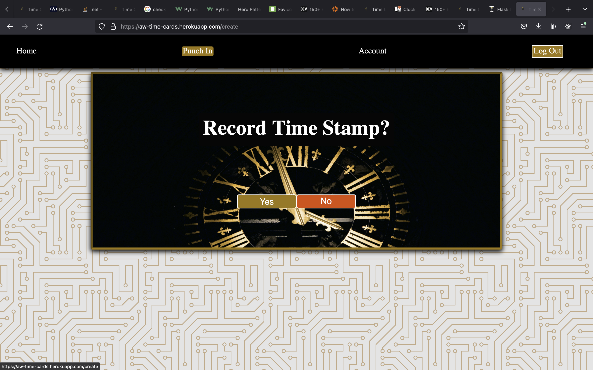

# Time Cards
Having once worked at a place where I had to record my attendance by writing on a sheet, typing it in excel, and sending it to HR.  I wanted to see what it would belike to build out the functionality of a clock in system using the crud operations I've learned.

For demonstration purposes, this app will allow users to punch in, punch out and view all time cards.

---

## Getting Started:

The app is deployed [*here*](https://aw-time-cards.herokuapp.com/).

---

## Screenshots:

### Desktop:

Landing Page:

Record Time Stamp:

Time Cards:

### Mobile:

<image src="./myapp/static/images/LandingM.jpg" width="200"/> <image src="./myapp/static/images/RecordM.jpg" width="200"/> <image src="./myapp/static/images/CardsM.jpg" width="200"/>

---

## Technologies Used:

---
## Planned Enhancements:

- Local time zones
- Add employer profiles
- Implement lunch breaks
- Export to a spreadsheet
  
---

## Credits:
- [Skill badges found at dev.to](https://dev.to/envoy_/150-badges-for-github-pnk)

- [CIrcuit Board background pattern courtesy of Steve Schoger](https://heropatterns.com/)

- Clock Photo by <a href="https://unsplash.com/@thomasbormans?utm_source=unsplash&utm_medium=referral&utm_content=creditCopyText">Thomas Bormans</a> on <a href="https://unsplash.com/images/things/clock?utm_source=unsplash&utm_medium=referral&utm_content=creditCopyText">Unsplash</a>